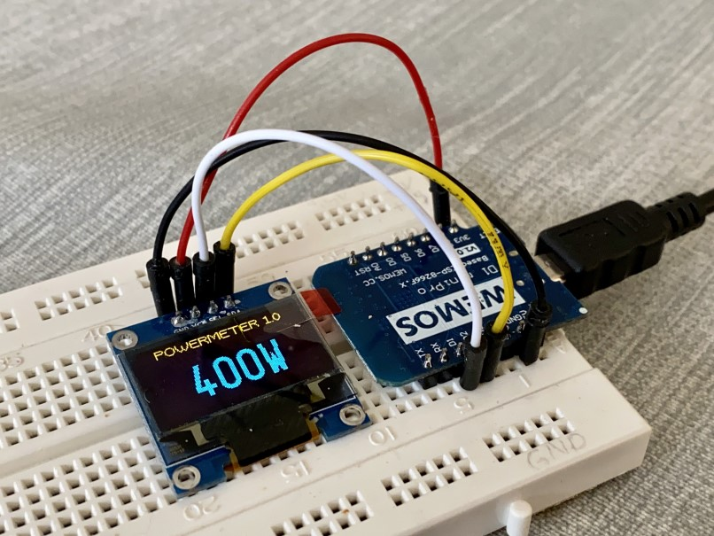
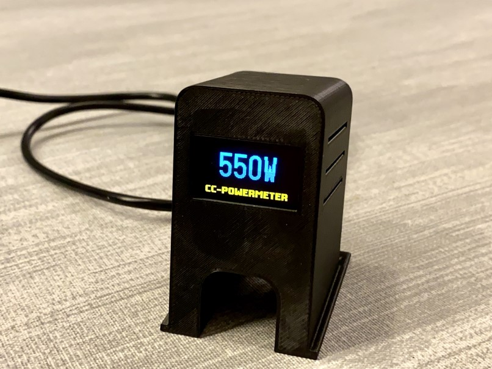

# MQTT-based powermeter
A simple MQTT-based powermeter for ESP8266

Shopping-list
-------------
- Wemos D1 mini pro
- 0.96" OLED-Display (I used an I2C version with SSD1306 controller)

Nice housing: https://www.thingiverse.com/thing:2884823S

I wanted to create a little display for showing the current power consumption in my house. My powermeter is monitored by an iobroker instance which sends the meter readings to some mqtt topics. It's really simple (mostly lib examplecode...) and can be used to show any kinds of data sent over mqtt.

I'm not a big C-guy, so any contribution os appreciated! :-)

I built this project with PlatformIO (see: https://platformio.org/). I really recommend this environment for any beginner, the setup is really easy and you're up and running in minutes!

